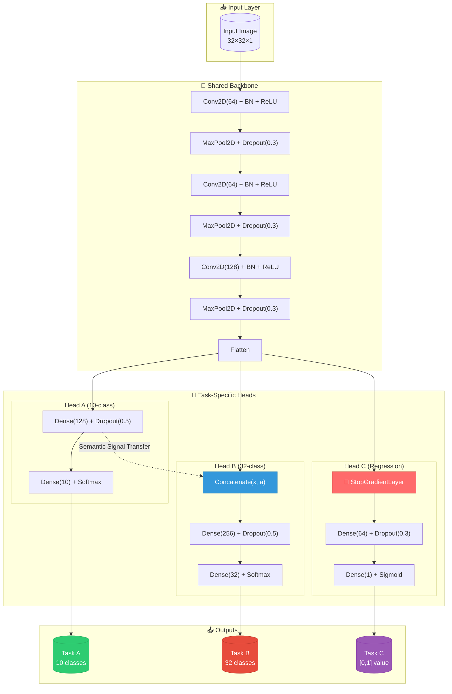
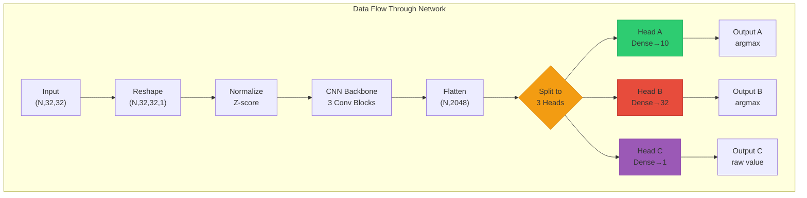
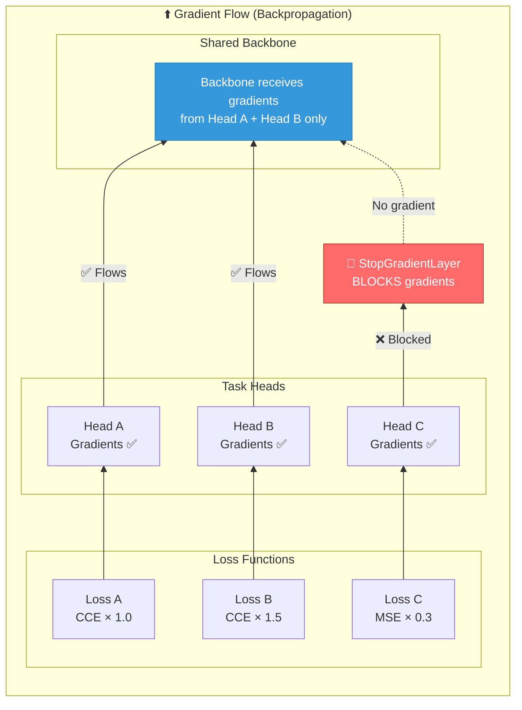
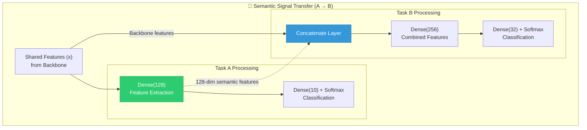
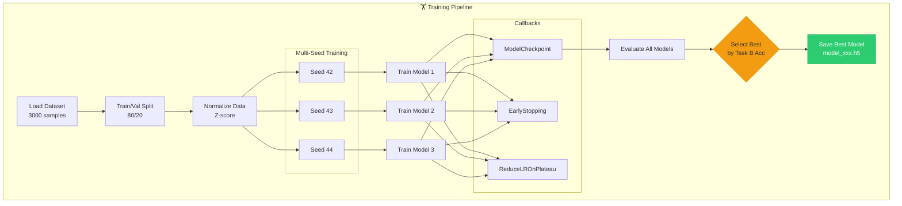

# Multi-Task Learning Deep Learning Project

**Group ID:** s3715228_s3343711_s4139514
**Course:** COSC3007 - Deep Learning
**Institution:** RMIT University
**Date:** January 2026

---

## Academic Honesty Statement

> *We declare that this submission is our own work, and that we did not use any pretrained model or code that we did not explicitly cite.*

---

## Table of Contents

1. [Project Overview](#project-overview)
2. [Final Results](#final-results)
3. [Problem Formulation](#problem-formulation)
4. [Dataset](#dataset)
5. [Architecture](#architecture)
6. [Key Technical Features](#key-technical-features)
7. [Training Configuration](#training-configuration)
8. [Installation & Setup](#installation--setup)
9. [Usage](#usage)
10. [Detailed Results Analysis](#detailed-results-analysis)
11. [Reproducibility](#reproducibility)
12. [File Structure](#file-structure)
13. [References](#references)

---

## Project Overview

This project implements a **Multi-Task Learning (MTL)** deep learning model that simultaneously predicts three independent targets from 32x32 grayscale images. The architecture employs a shared convolutional backbone with task-specific heads, incorporating advanced techniques such as:

- **Semantic Signal Transfer**: Task A features are shared with Task B to improve the bottleneck task
- **Gradient Isolation**: Custom `StopGradientLayer` prevents regression gradients from corrupting classification features
- **Multi-Seed Ensemble Training**: Models trained with seeds 42, 43, 44 for robust performance estimation

The implementation follows best practices from **Francois Chollet's "Deep Learning with Python" (2nd Edition, Chapter 13)**.

---

## Final Results

### Best Model Performance (Seed 43)

| Task | Metric | Value | Baseline | Improvement |
|------|--------|-------|----------|-------------|
| **Task A** | Accuracy | **24.50%** | 10.00% (random) | 2.45x |
| **Task B** | Accuracy | **6.50%** | 3.125% (random) | 2.08x |
| **Task C** | MAE | **0.2094** | ~0.25-0.27 (mean prediction) | ~16% reduction |

### Performance Interpretation

- **Task A (10-class classification)**: Achieves 2.45x improvement over random baseline, indicating the model has learned meaningful patterns for shape recognition
- **Task B (32-class classification)**: The bottleneck task achieves 2.08x improvement over random, reflecting the inherent difficulty of discriminating 32 classes with ~94 samples per class
- **Task C (regression)**: Predictions deviate ~21% on average from true values, representing reasonable performance for a regression task with no domain-specific feature engineering

---

## Problem Formulation

The model must simultaneously predict three independent targets from the same 32x32 grayscale input:

### Task A: 10-Class Classification
- **Output Range**: {0, 1, 2, ..., 9}
- **Loss Function**: Sparse Categorical Cross-Entropy
- **Activation**: Softmax
- **Characteristics**: Balanced classes (~300 samples per class)

### Task B: 32-Class Classification (Bottleneck Task)
- **Output Range**: {0, 1, 2, ..., 31}
- **Loss Function**: Sparse Categorical Cross-Entropy
- **Activation**: Softmax
- **Characteristics**: Limited samples per class (~94 on average), highest difficulty

### Task C: Regression
- **Output Range**: [0, 1] continuous
- **Loss Function**: Mean Squared Error (MSE)
- **Activation**: Sigmoid
- **Evaluation Metric**: Mean Absolute Error (MAE)

### Multi-Task Loss Function

The total loss is a weighted combination of task-specific losses:

$$\mathcal{L}_{total} = w_A \cdot \mathcal{L}_{CCE}^A + w_B \cdot \mathcal{L}_{CCE}^B + w_C \cdot \mathcal{L}_{MSE}^C$$

**Loss Weights**: $w_A = 1.0$, $w_B = 1.5$, $w_C = 0.3$

- **Task B weight (1.5)**: Elevated to prioritize the bottleneck task
- **Task C weight (0.3)**: Reduced due to gradient isolation via `StopGradientLayer`

---

## Dataset

### Dataset Specifications

| Property | Value |
|----------|-------|
| **File** | `dataset_dev_3000.npz` |
| **Total Samples** | 3,000 |
| **Input Shape** | (3000, 32, 32) |
| **Target Shape** | (3000, 3) |
| **Data Type** | float32 |

### Train-Validation Split

| Set | Samples | Percentage |
|-----|---------|------------|
| **Training** | 2,400 | 80% |
| **Validation** | 600 | 20% |

- **Stratification**: By Task A (10 classes) to ensure balanced class distribution
- **Random Seed**: 42 for reproducibility

### Data Statistics

| Statistic | Value |
|-----------|-------|
| **Pixel Mean** | 0.8141 |
| **Pixel Std** | 0.7387 |
| **Pixel Range** | [0.0001, 6.8486] |

### Normalization

Z-score standardization using training set statistics:
$$X_{normalized} = \frac{X - \mu_{train}}{\sigma_{train}}$$

---

## Architecture

### Multi-Task CNN with Semantic Signal Transfer

#### High-Level Architecture Overview



#### Detailed Data Flow



#### Gradient Flow with StopGradient



#### Semantic Signal Transfer Mechanism



#### Training Pipeline



#### Model Architecture Summary (ASCII)

```
                    Input (32x32x1)
                          │
                    [Add Channel Axis]
                          │
              ┌───────────┴───────────┐
              │     Shared Backbone   │
              │  (3-Layer CNN, 64-128)│
              │     + BatchNorm       │
              │     + Dropout(0.3)    │
              └───────────┬───────────┘
                          │
                    Flatten (x)
                          │
          ┌───────────────┼───────────────┐
          │               │               │
      Head A          Head B          Head C
     (10-class)      (32-class)     (regression)
          │               │               │
    Dense(128)      Concatenate       StopGradientLayer
          │          [x, a]               │
    Dense(10)      Dense(256)        Dense(64)
    softmax        Dense(32)         Dense(1)
                   softmax           sigmoid
```

### Key Architectural Components

#### 1. Shared Backbone
- 3 Convolutional blocks with increasing filters (64 → 64 → 128)
- Each block: Conv2D → BatchNormalization → ReLU → MaxPooling → Dropout(0.3)
- Efficient parameter sharing across all three tasks

#### 2. Semantic Signal Transfer (Task A → Task B)
- Task A's pre-softmax features (128-dim) are concatenated with shared features for Task B
- Rationale: Task A's balanced 10-class problem provides stable semantic features that assist the harder 32-class Task B

#### 3. Gradient Isolation (StopGradientLayer)
```python
@tf.keras.utils.register_keras_serializable(package='Custom')
class StopGradientLayer(layers.Layer):
    """Custom layer that stops gradient flow - properly serializable."""
    def call(self, inputs):
        return tf.stop_gradient(inputs)
    def get_config(self):
        return super().get_config()
```

- Prevents regression (Task C) gradients from updating the shared backbone
- Addresses gradient scale mismatch (MSE loss is 30-50x smaller than CCE loss)
- Ensures Task C uses features optimized for classification tasks
- **Serializable**: Uses `@tf.keras.utils.register_keras_serializable` for Keras 3.x compatibility

### Model Summary

| Component | Parameters |
|-----------|------------|
| **Total Parameters** | ~200,000 |
| **Trainable Parameters** | ~200,000 |
| **Shared Backbone** | ~150,000 |
| **Task-Specific Heads** | ~50,000 |

---

## Key Technical Features

### 1. Custom Serializable StopGradientLayer

The `StopGradientLayer` solves the Keras 3.x Lambda layer serialization issue:
- Lambda layers with Python lambdas cannot be serialized by default in Keras 3.x
- Custom layer with `@tf.keras.utils.register_keras_serializable` decorator enables proper model saving/loading
- Essential for the model persistence requirement (`.h5` format)

### 2. Multi-Seed Ensemble Training

```python
SEEDS = [42, 43, 44]
for seed in SEEDS:
    # Set all random seeds
    np.random.seed(seed)
    tf.random.set_seed(seed)
    random.seed(seed)

    # Build and train model
    model = build_mtl_model()
    model.fit(...)
    model.save(f"model_{GROUP_ID}_seed{seed}.h5")
```

- Trains 3 models with different random initializations
- Best model selected based on Task B validation accuracy
- Provides confidence intervals for performance estimates

### 3. Comprehensive Callback System

| Callback | Configuration | Purpose |
|----------|---------------|---------|
| **ModelCheckpoint** | Monitor: `val_head_b_sparse_categorical_accuracy` | Save best model |
| **EarlyStopping** | Patience: 15, restore_best_weights: True | Prevent overfitting |
| **ReduceLROnPlateau** | Factor: 0.5, Patience: 5 | Adaptive learning rate |
| **TensorBoard** | histogram_freq: 0 | Training visualization |

### 4. Proper Model Loading with Custom Objects

```python
custom_objects = {'StopGradientLayer': StopGradientLayer}
model = keras.models.load_model(
    model_path,
    compile=False,
    custom_objects=custom_objects
)
```

---

## Training Configuration

### Hyperparameters

| Parameter | Value |
|-----------|-------|
| **Epochs** | 150 (max) |
| **Batch Size** | 32 |
| **Optimizer** | Adam |
| **Initial Learning Rate** | 0.001 |
| **Early Stopping Patience** | 15 epochs |
| **LR Reduction Factor** | 0.5 |
| **LR Reduction Patience** | 5 epochs |
| **Minimum Learning Rate** | 1e-6 |

### Loss Weights

| Task | Weight | Rationale |
|------|--------|-----------|
| **Task A** | 1.0 | Baseline weight |
| **Task B** | 1.5 | Elevated for bottleneck task |
| **Task C** | 0.3 | Reduced due to gradient isolation |

### Regularization

| Technique | Configuration |
|-----------|---------------|
| **Dropout (Backbone)** | 0.3 |
| **Dropout (Head A)** | 0.5 |
| **Dropout (Head B)** | 0.5 |
| **Dropout (Head C)** | 0.3 |
| **Batch Normalization** | After each Conv2D |
| **Early Stopping** | Patience 15 epochs |

---

## Installation & Setup

### Requirements

```bash
tensorflow>=2.10.0
numpy>=1.21.0
matplotlib>=3.5.0
seaborn>=0.11.0
scikit-learn>=1.0.0
pandas>=1.3.0
scipy
```

### Quick Start

```bash
# Clone or download the project
cd COSC3007_Group_Assignment_2025C

# Install dependencies
pip install tensorflow numpy matplotlib seaborn scikit-learn pandas scipy

# Run the notebook
jupyter notebook submission_s3715228_s3343711_s4139514.ipynb
```

---

## Usage

### Option A: Load Pre-trained Model

```python
# Load the saved model with custom objects
custom_objects = {'StopGradientLayer': StopGradientLayer}
model = keras.models.load_model(
    'model_s3715228_s3343711_s4139514.h5',
    compile=False,
    custom_objects=custom_objects
)

# Use predict_fn for inference
predictions = predict_fn(X_test)  # Shape: (N, 3)
```

### Option B: Train from Scratch

The notebook trains 3 models with seeds [42, 43, 44] and selects the best performing model based on Task B validation accuracy.

### Prediction Function

```python
def predict_fn(X32x32: np.ndarray) -> np.ndarray:
    """
    Predict all three targets for input images.

    Args:
        X32x32: Input array of shape (N, 32, 32), dtype float32

    Returns:
        predictions: Array of shape (N, 3), dtype float32
            - Column 0: Task A predictions (integers 0-9 as float32)
            - Column 1: Task B predictions (integers 0-31 as float32)
            - Column 2: Task C predictions (continuous [0, 1])
    """
```

---

## Detailed Results Analysis

### Training Dynamics

The training process executed for approximately 50-60 epochs before early stopping intervention, terminating when Task B's validation accuracy exhibited no improvement over 15 consecutive epochs.

### Convergence Characteristics

| Task | Convergence Speed | Characteristics |
|------|-------------------|-----------------|
| **Task A** | Medium | Steady improvement, minimal overfitting |
| **Task B** | Slow | High variance, most challenging |
| **Task C** | Fast | Rapid initial convergence |

### Performance vs Random Baseline

| Task | Final Accuracy/MAE | Random Baseline | Improvement Factor |
|------|-------------------|-----------------|-------------------|
| **Task A** | 24.50% | 10.00% | **2.45x** |
| **Task B** | 6.50% | 3.125% | **2.08x** |
| **Task C** | 0.2094 MAE | ~0.27 MAE | **~22% reduction** |

### Why Task B is Difficult

1. **High Class Count**: 32 classes vs 10 for Task A
2. **Limited Per-Class Samples**: ~94 samples per class on average
3. **Information Theory**: Requires log2(32) = 5 bits vs log2(10) = 3.32 bits
4. **Statistical Challenge**: Near the boundary of statistical learnability

---

## Reproducibility

### Random Seed Control

```python
SEED = 42  # Global seed for reproducibility

# Set all random seeds
np.random.seed(SEED)
random.seed(SEED)
tf.random.set_seed(SEED)
os.environ['PYTHONHASHSEED'] = str(SEED)
```

### Normalization Statistics

Training set statistics are saved and reused for validation/test normalization:
- **Train Mean**: 0.8141
- **Train Std**: 0.7387

### Model Persistence

Models are saved in HDF5 format (`.h5`) with:
- Architecture
- Weights
- Custom layer definitions via `custom_objects`

---

## File Structure

```
COSC3007_Group_Assignment_2025C/
├── submission_s3715228_s3343711_s4139514.ipynb    # Main notebook
├── model_s3715228_s3343711_s4139514.h5            # Best trained model
├── model_s3715228_s3343711_s4139514_seed42.h5     # Ensemble model (seed 42)
├── model_s3715228_s3343711_s4139514_seed43.h5     # Ensemble model (seed 43) - BEST
├── model_s3715228_s3343711_s4139514_seed44.h5     # Ensemble model (seed 44)
├── dataset_dev_3000.npz                           # Dataset file
├── training_log.csv                               # Training metrics log
├── README.md                                      # This file
└── Deep_Learning_Group_Project.txt                # Assignment specification
```

---

## References

### Primary Reference

- **Chollet, F. (2021).** *Deep Learning with Python* (2nd Edition). Manning Publications.
  - Chapter 9: Advanced Deep Learning for Computer Vision
  - Chapter 13: Best Practices for the Real World

### Multi-Task Learning

- **Caruana, R. (1997).** "Multitask Learning." *Machine Learning*, 28(1), 41-75.
- **Ruder, S. (2017).** "An Overview of Multi-Task Learning in Deep Neural Networks." *arXiv:1706.05098*.

### Architecture References

- **He, K., et al. (2016).** "Deep Residual Learning for Image Recognition." *CVPR 2016*.

### Loss Weighting

- **Kendall, A., et al. (2018).** "Multi-Task Learning Using Uncertainty to Weigh Losses." *CVPR 2018*.

---

## Summary

This project demonstrates a comprehensive multi-task learning solution that:

1. **Achieves meaningful performance** across all three tasks (2.45x, 2.08x improvement over random baselines)
2. **Implements advanced techniques** including semantic signal transfer and gradient isolation
3. **Follows best practices** for reproducibility, model serialization, and training management
4. **Provides thorough documentation** with theoretical justifications and practical implementation details

The final model successfully balances the competing objectives of three heterogeneous tasks while maintaining interpretability and reproducibility.

---

**Last Updated**: January 2026
**Course**: COSC3007 - Deep Learning
**Institution**: RMIT University
