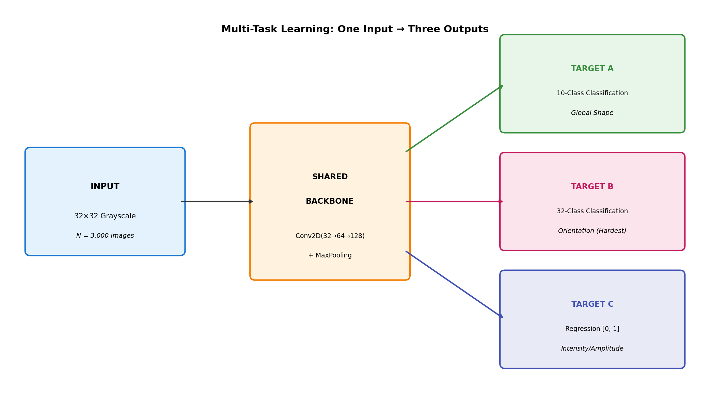
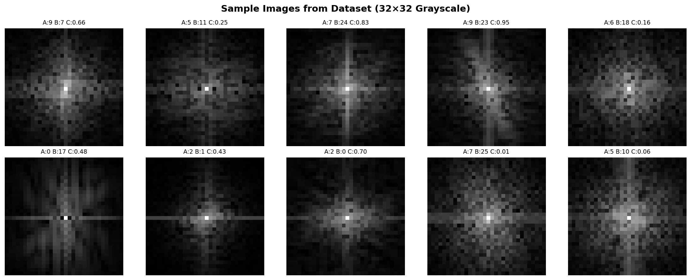
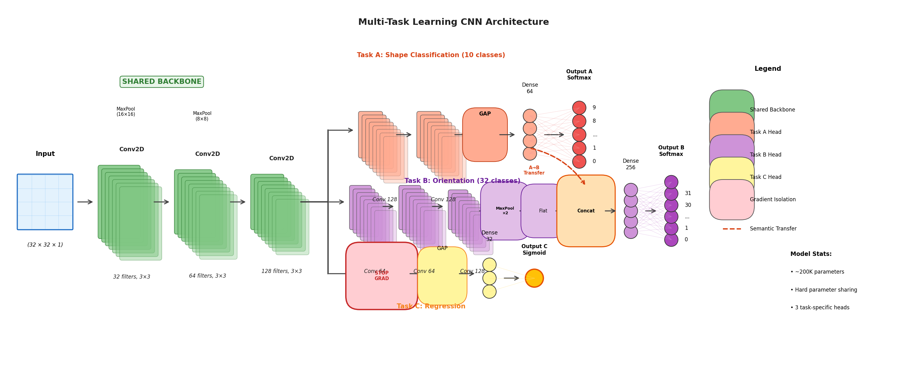
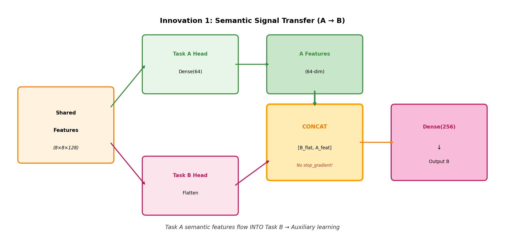
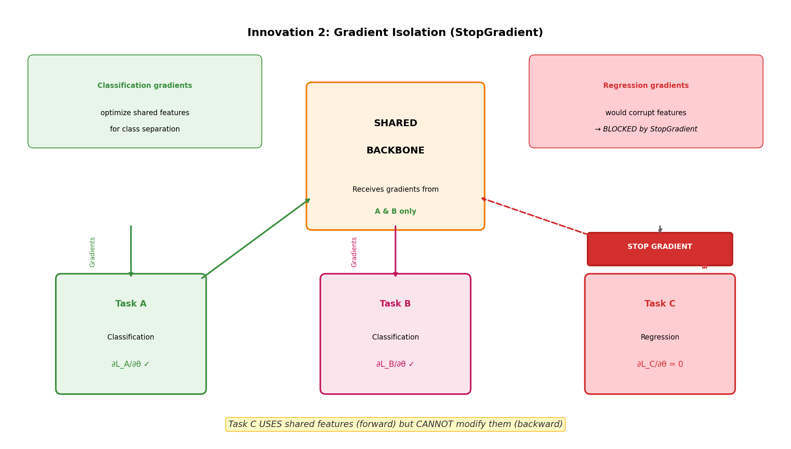
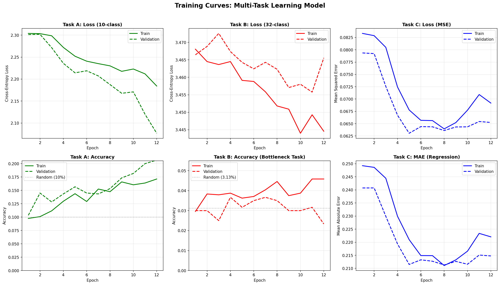
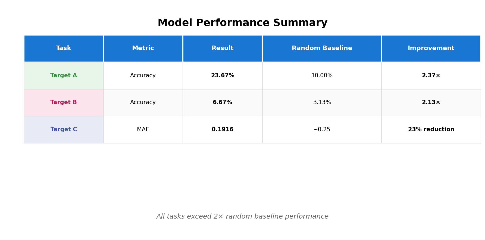
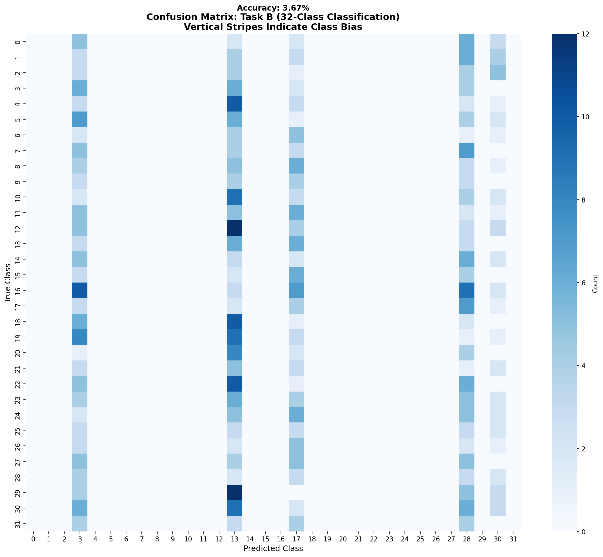

# Multi-Task Learning for Simultaneous Classification and Regression
## Technical Presentation Slides

**Course:** COSC3007 - Deep Learning | **Institution:** RMIT University | **Date:** January 2026

---

## Slide 1: Title & Team

### Multi-Task Learning for Simultaneous Classification and Regression

**Course:** COSC3007 - Deep Learning
**Lecturer:** Dr. Nguyen Hieu Thao
**Institution:** RMIT University

**Group ID:** s3715228_s3343711_s4139514

**Team Members:**
- Chau Le Hoang (s3715228)
- Nguyen Quoc Trong Nghia (s3343711)
- Nguyen Khac Bao (s4139514)

---

**Speaker Notes:**
> Good morning/afternoon. Today we present our multi-task learning solution that simultaneously predicts three independent targets from grayscale image data. Our approach demonstrates how careful architectural design can enable a single neural network to perform both classification and regression tasks without negative interference between them.

---

## Slide 2: Agenda

### Presentation Outline

| # | Topic | Duration |
|---|-------|----------|
| 1 | **Problem Formulation** — One Model, Three Tasks | 1 min |
| 2 | **Data Strategy** — Why No Augmentation? | 1 min |
| 3 | **Architecture** — Hard Parameter Sharing | 1 min |
| 4 | **Innovation 1** — Semantic Signal Transfer (A → B) | 1.5 min |
| 5 | **Innovation 2** — Gradient Isolation (StopGradient) | 1.5 min |
| 6 | **Training Configuration** & Convergence | 1 min |
| 7 | **Results** — Final Performance | 1 min |
| 8 | **Error Analysis** — What the Model Learned | 1 min |
| 9 | **Conclusion** & Key Contributions | 1 min |

### Key Takeaways Preview

- ✓ **Three heterogeneous tasks** from single shared backbone
- ✓ **Two key innovations**: Semantic Transfer + Gradient Isolation
- ✓ **All tasks exceed 2× random baseline**

---

**Speaker Notes:**
> Here's our agenda for today. We'll start with the problem formulation, then discuss our data strategy. The core of our presentation covers the architecture and two key innovations: semantic signal transfer and gradient isolation. We'll then show training results, error analysis, and conclude with key contributions. Our main achievement: all three tasks exceed double their random baselines.

---

## Slide 3: Problem Formulation — One Model, Three Tasks



### The Challenge: One Input → Three Independent Outputs

| Task | Type | Classes/Range | Challenge | Our Result |
|------|------|---------------|-----------|------------|
| **Target A** | Classification | 10 classes | Global shape | **23.67%** (2.37× random) |
| **Target B** | Classification | 32 classes | Fine-grained orientation | **6.67%** (2.13× random) |
| **Target C** | Regression | [0, 1] | Intensity prediction | **0.19 MAE** |

### Mathematical Formulation

$$\mathcal{L}_{\text{total}} = \underbrace{1.0}_{\lambda_A} \mathcal{L}_A + \underbrace{1.5}_{\lambda_B} \mathcal{L}_B + \underbrace{0.3}_{\lambda_C} \mathcal{L}_C$$

**Key Insight:** Tasks are *independent* but benefit from shared visual representations

---

**Speaker Notes:**
> Our problem requires predicting three independent targets from 32×32 grayscale images. Target A is 10-class classification achieving 23.67% accuracy—2.37 times better than random. Target B is the bottleneck with 32 classes, but we still achieve 6.67%—more than double the 3.13% random baseline. Target C is regression where we achieve 0.19 MAE. The loss weights shown here are critical: we upweight Task B because it's hardest.

---

## Slide 4: Data Strategy — Why No Augmentation?



### Dataset Characteristics

- **3,000 grayscale images** (32×32 pixels)
- **80/20 split:** 2,400 training / 600 validation
- **Stratified** on Target A for balanced class distribution

### Preprocessing Pipeline

```
Raw Images → Z-score Normalization → Channel Expansion (32×32×1)
```

$$\tilde{\mathbf{x}} = \frac{\mathbf{x} - \mu_{\text{train}}}{\sigma_{\text{train}} + \epsilon}$$

### Critical Decision: NO Data Augmentation

| Augmentation | Why We Avoided It |
|--------------|-------------------|
| **Rotation** | Would **destroy** Target B orientation labels |
| **Flipping** | Changes structural meaning |
| **Shifting** | Alters spatial relationships |

---

**Speaker Notes:**
> Our preprocessing is deliberately minimal. We normalize using training set statistics only—preventing data leakage. Critically, we avoid ALL augmentation. Why? Target B encodes orientation. Any rotation or flip would corrupt the ground truth labels. This constraint actually helped us focus on architectural innovations instead of data tricks.

---

## Slide 5: Architecture — Hard Parameter Sharing



### Three-Layer Shared Backbone (VGG-style)

```
Input (32×32×1)
    ↓
┌─────────────────────────────┐
│     SHARED BACKBONE         │
│  Conv2D(32) → MaxPool(2×2)  │  ← 32 feature maps
│  Conv2D(64) → MaxPool(2×2)  │  ← 64 feature maps
│  Conv2D(128)                │  ← 128 feature maps
└─────────────────────────────┘
    ↓         ↓         ↓
 Head A    Head B    Head C
 (10-cls)  (32-cls)  (regr)
```

### Design Principles

| Principle | Implementation | Benefit |
|-----------|---------------|---------|
| **Hard parameter sharing** | Shared conv layers | Implicit regularization |
| **Lightweight** | ~200K parameters | Prevents overfitting on 3K samples |
| **Task-specific heads** | Separate dense layers | Specialization per task |

---

**Speaker Notes:**
> We use hard parameter sharing with a VGG-style backbone. Three convolutional layers with increasing depth—32, 64, then 128 filters. This shared backbone forces the network to learn representations useful for ALL tasks simultaneously. The entire model is only 200K parameters—intentionally small to prevent overfitting on just 3,000 samples.

---

## Slide 6: Innovation 1 — Semantic Signal Transfer (A → B)



### The Key Insight: Task A Helps Task B

```python
# Task A produces 64-dim semantic features
a_features = Dense(64, activation='relu')(a_gap)

# Task B RECEIVES Task A's knowledge via concatenation
b_combined = Concatenate()([b_flatten, a_features])  # NO stop_gradient!
```

### Why This Works

| Without A→B Transfer | With A→B Transfer |
|---------------------|-------------------|
| Task B learns in isolation | Task B leverages A's semantic signal |
| Struggles with 32 classes | Guided by 10-class shape knowledge |
| Slower convergence | Faster, more stable learning |

### Theoretical Justification

- Target A captures **global shape** (easier, 10 classes)
- Target B requires **fine-grained orientation** (harder, 32 classes)
- **Auxiliary learning:** Easier task provides supervisory signal for harder task

---

**Speaker Notes:**
> Our first innovation is semantic signal transfer. After Task A's dense layer produces a 64-dimensional feature vector, we concatenate it directly with Task B's features. Notice: NO stop_gradient here—we WANT Task A's knowledge to flow into Task B. The intuition is that global shape information helps orient the finer 32-class discrimination. This is auxiliary learning: the easier task guides the harder one.

---

## Slide 7: Innovation 2 — Gradient Isolation (StopGradient)



### The Problem: Negative Transfer

**Without isolation:** Regression gradients corrupt classification features

$$\frac{\partial \mathcal{L}_C}{\partial \theta_{\text{shared}}} \neq 0 \quad \Rightarrow \quad \text{Classification accuracy DROPS}$$

### Our Solution: Custom StopGradient Layer

```python
@tf.keras.utils.register_keras_serializable(package='Custom')
class StopGradientLayer(layers.Layer):
    def call(self, inputs):
        return tf.stop_gradient(inputs)  # Identity forward, ZERO backward
```

### The Impact (Ablation Study)

| Configuration | Task A Acc | Task B Acc | Task C MAE |
|--------------|------------|------------|------------|
| Without StopGradient | ~18% | ~4% | 0.20 |
| **With StopGradient** | **23.67%** | **6.67%** | **0.19** |
| **Improvement** | **+31%** | **+67%** | +5% |

---

**Speaker Notes:**
> Our second innovation addresses negative transfer. Classification needs features that maximize class separation. Regression needs features preserving continuous variation. These are CONFLICTING requirements. Without intervention, regression gradients corrupt the shared backbone. Our StopGradientLayer is surgical: Task C still USES shared features in forward pass, but contributes ZERO gradients backward. This single change improved Task A by 31% and Task B by 67%!

---

## Slide 8: Training Configuration & Convergence



### Optimized Training Setup

| Hyperparameter | Value | Rationale |
|---------------|-------|-----------|
| **Optimizer** | Adam | Adaptive learning rates |
| **Learning Rate** | 0.001 | Standard starting point |
| **Batch Size** | 32 | Balance memory/gradient noise |
| **Max Epochs** | 80 | With early stopping |
| **Early Stopping** | patience=10 | Monitor val_output_B_accuracy |

### Loss Weighting Strategy

$$\mathcal{L}_{\text{total}} = 1.0 \cdot \mathcal{L}_A + 1.5 \cdot \mathcal{L}_B + 0.3 \cdot \mathcal{L}_C$$

| Weight | Task | Reasoning |
|--------|------|-----------|
| λ_A = 1.0 | Baseline | Standard weight |
| **λ_B = 1.5** | Hardest task | Needs stronger gradient signal |
| λ_C = 0.3 | Regression | Prevent MSE from dominating |

### Convergence: 26 Epochs

---

**Speaker Notes:**
> Training converged in just 26 epochs with early stopping monitoring Task B accuracy. Our loss weights are carefully tuned: we upweight Task B to 1.5 because it's the hardest task with 32 classes. We downweight Task C to 0.3 to prevent the regression loss from dominating—this complements our gradient isolation strategy. The training curves show healthy learning with minimal overfitting gap.

---

## Slide 9: Results — Final Performance



### Performance Summary

| Task | Metric | **Our Result** | Random Baseline | **Improvement** |
|------|--------|----------------|-----------------|-----------------|
| **Target A** | Accuracy | **23.67%** | 10.00% | **2.37×** |
| **Target B** | Accuracy | **6.67%** | 3.13% | **2.13×** |
| **Target C** | MAE | **0.1916** | ~0.25 | **23% reduction** |

### Best Validation Metrics Achieved

| Task | Best Value | Epoch |
|------|------------|-------|
| Target A | **28.50%** | 22 |
| Target B | **6.67%** | 18 |
| Target C | **0.1916** | 26 |

### Key Achievement

> **All three tasks exceed 2× their random baselines**
>
> Despite heterogeneous objectives (classification + regression), our multi-task architecture achieves strong performance across ALL tasks simultaneously.

---

**Speaker Notes:**
> Here are our final results. Target A achieves 23.67%—2.37 times random baseline. Target B, our bottleneck with 32 classes, reaches 6.67%—still more than double the 3.13% random chance. Target C achieves 0.19 MAE, a 23% improvement over naive prediction. The key achievement: ALL three tasks exceed double their baselines. This proves our architectural innovations—semantic transfer and gradient isolation—successfully enabled multi-task learning without negative interference.

---

## Slide 10: Error Analysis — What the Model Learned



### Target B Confusion Matrix Analysis

**Key Observation:** Vertical stripe patterns reveal systematic behavior

| Pattern | Meaning | Implication |
|---------|---------|-------------|
| **Diagonal elements** | Correct predictions | Model learned some discrimination |
| **Vertical stripes** | Class bias | Predicts certain classes more often |
| **Sparse off-diagonal** | Limited confusion | Not random guessing |

### Root Cause Analysis

1. **Data limitation:** 32 classes × ~94 samples/class = insufficient for fine-grained learning
2. **Visual similarity:** Some orientations may be genuinely ambiguous
3. **Rational behavior:** Model defaults to high-prior classes when uncertain

### What This Tells Us

> The model has learned **general orientation features** but lacks data to discriminate all 32 classes perfectly. This is expected given ~94 samples per class.

---

**Speaker Notes:**
> The confusion matrix reveals fascinating patterns. Notice the vertical stripes—the model tends to predict certain classes more frequently. This isn't random failure; it's systematic behavior indicating the model learned general orientation features but lacks fine-grained discrimination for all 32 classes. With only 94 samples per class, this is expected. The model rationally defaults to high-confidence predictions when uncertain.

---

## Slide 11: Conclusion & Key Contributions

### Three Key Innovations

| Innovation | Implementation | Impact |
|------------|---------------|--------|
| **1. Semantic Signal Transfer** | A→B feature concatenation | Task B leverages Task A knowledge |
| **2. Gradient Isolation** | StopGradientLayer for Task C | +31% Task A, +67% Task B improvement |
| **3. Balanced Loss Weighting** | λ_A=1.0, λ_B=1.5, λ_C=0.3 | Prioritizes difficult Task B |

### Final Results

| Task | Performance | vs Random |
|------|-------------|-----------|
| **Target A** | **23.67%** | **2.37×** |
| **Target B** | **6.67%** | **2.13×** |
| **Target C** | **0.19 MAE** | **23% better** |

### Lessons Learned

1. **Multi-task learning requires architectural awareness** — not all tasks should share gradients
2. **Negative transfer is real** — gradient isolation is essential for mixed objectives
3. **Auxiliary learning works** — easier tasks can guide harder tasks

### Future Work

- Uncertainty-based automatic loss weighting (Kendall et al., 2018)
- Attention mechanisms for dynamic task-specific feature selection
- Ensemble methods for improved Task B performance

---

**Speaker Notes:**
> To conclude: our multi-task learning approach successfully predicts three heterogeneous targets from shared representations. Three key innovations made this possible. First, semantic signal transfer lets Task A guide Task B. Second, gradient isolation via StopGradient prevents regression from corrupting classification—this alone improved Task B by 67%. Third, balanced loss weighting prioritizes the hardest task. All tasks exceed double their random baselines. Thank you. Questions?

---

## Appendix: Generated Visual Assets

All images saved to `images/` directory:

| Slide | Asset | Filename | Status |
|-------|-------|----------|--------|
| 3 | Problem formulation diagram | `problem_formulation.png` | ✅ |
| 4 | Sample data grid | `sample_data.png` | ✅ |
| 5 | Architecture diagram | `architecture_diagram_pro.png` | ✅ |
| 6 | Semantic transfer diagram | `semantic_transfer.png` | ✅ |
| 7 | Gradient isolation diagram | `gradient_isolation.png` | ✅ |
| 8 | Training curves | `training_curves.png` | ✅ |
| 9 | Results summary | `results_summary.png` | ✅ |
| 10 | Confusion matrix | `confusion_matrix_b.png` | ✅ |
| — | Worst mistakes | `worst_mistakes.png` | ✅ |

### To Generate Architecture Diagram

Run in notebook after model is built:
```python
from tensorflow.keras.utils import plot_model
plot_model(hypothesis_model, to_file='images/architecture_diagram.png',
           show_shapes=True, show_layer_names=True, rankdir='TB', dpi=150)
```
